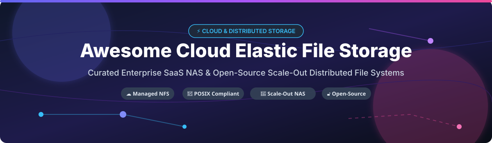

# Awesome-Cloud-Elastic-File-Storage 🗄️ 📂

  

  
  
  
  
  
  

---

## 🌟 Top Cloud Elastic File Storage & Scale-Out NAS Ecosystem

**Curated Directory of Cloud Elastic File Systems, Enterprise NAS Platforms, Managed NFS/SMB Services, and Open-Source Distributed File Systems** 🚀

*Focused on Serverless NFS, Scale-Out NAS, Global File Systems, POSIX-Compliant Kubernetes Storage (CSI), Multi-Cloud Portability & High-Performance Parallel Clustered Storage* 🌐

**Last updated: October 2026** 📅

---

### 📌 Overview & SEO Summary

Welcome to the ultimate curated resource for enterprise **cloud elastic file storage platforms**, **open-source distributed file systems**, and **global namespace network attached storage (NAS)**. Elastic file storage enables dynamic, pay-as-you-grow filesystem provisioning without upfront hardware allocation, making it critical for cloud-native applications, AI/ML model training, Kubernetes persistent volumes, DevOps CI/CD pipelines, and high-performance computing (HPC).

Whether evaluating hyperscaler-managed NFS/SMB offerings (such as **Amazon EFS**, **Azure Files**, and **Google Cloud Filestore**) or self-managed open-source clustered solutions (like **SeaweedFS**, **CephFS**, **JuiceFS**, **Rook**, and **GlusterFS**), this guide provides comprehensive pricing specs, free tier/trial boundaries, corporate valuations, and open-source star metrics.

---

## 📑 Table of Contents

- [📊 Sector Market Size & Market Structure](#-sector-market-size--market-structure)
- [🏢 SaaS & Commercial Platforms](#-saas--commercial-platforms)
- [🔓 Open-Source GitHub Projects](#-open-source-github-projects)
- [🛠️ How to Contribute](#%EF%B8%8F-how-to-contribute)
- [📊 Star History](#-star-history)
- [🤝 Support & Sponsorship](#-support--sponsorship)
- [⚠️ Disclaimer](#%EF%B8%8F-disclaimer)

---

## 📊 Sector Market Size & Market Structure

The global **Cloud Elastic File Storage and Enterprise NAS Market** is estimated at **$9.8 Billion in 2026** and is projected to reach **$24.5 Billion by 2031**, growing at a CAGR of **20.1%** 📈. Driven by rapid growth in AI/ML training datasets, containerized microservices persistent storage, and enterprise hybrid-cloud migrations, the sector exhibits a **moderately concentrated, hyperscaler-dominated market structure** 🏛️. 

While public cloud titans (Microsoft, Amazon, Google) control ~65% of managed cloud file storage revenues via native NFS/SMB integration, specialized high-performance parallel file system vendors (Pure Storage, NetApp, WekaIO, Qumulo) capture high-margin enterprise AI and HPC workloads.

---

## 🏢 SaaS / Commercial Platforms

*Sorted by Corporate Valuation / Market Capitalization (Descending)* 📉

The commercial market features **hyperscaler managed NFS/SMB services** with serverless pay-per-use scaling alongside **software-defined enterprise file platforms** offering cross-cloud replication, global caching, continuous snapshots, and sub-millisecond IOPS performance.

| SaaS / Commercial Platform | Company / Owner | Valuation / Market Cap | Pricing (Starting Tier) | Free Tier / Free Trial Limits | Description |
| :--- | :--- | :--- | :--- | :--- | :--- |
| **[Azure Files](https://azure.microsoft.com/en-us/products/storage/files/)** 🔷 | Microsoft | **~$3.90 Trillion** | **$0.06/GB-month** (Hot LRS Tier); **$0.16/GB-month** (Premium SSD) | **5 GB LRS hot file storage free for 12 months** | **Azure-native managed file shares** — Supports SMB 3.0 & NFS v4.1 protocols with Azure AD Kerberos authentication, snapshots, and soft delete. |
| **[Amazon EFS](https://aws.amazon.com/efs/)** ☁️ | Amazon | **~$2.00 Trillion** | **$0.30/GB-month** (Standard); **$0.016/GB-month** (IA); **$0.008/GB-month** (Archive) | **5 GB EFS Standard storage free for 12 months** | **AWS-native serverless NFS** — Elastic throughput scaling, multi-AZ durability, sub-millisecond SSD latency, and automatic lifecycle tiering. |
| **[Google Cloud Filestore](https://cloud.google.com/filestore)** 🌐 | Google (Alphabet) | **~$2.00 Trillion** | **$0.16/GB-month** (Basic HDD); **$0.30/GB-month** (Basic SSD) | **$300 free trial credits valid for 90 days** | **GCP-native managed NFS** — High-performance file storage for GKE, Compute Engine, and enterprise file shares with independent IOPS and capacity scaling. |
| **[NetApp Cloud Volumes ONTAP](https://cloud.netapp.com/)** 🔵 | NetApp | **~$20.0 Billion** | **$0.066/GB-month** (Standard); **$0.132/GB-month** (Premium) | **30-day free trial on AWS, Azure, and GCP marketplaces** | **Multi-cloud enterprise NAS** — Feature-rich ONTAP storage management with global deduplication, thin provisioning, instant cloning, and WORM compliance. |
| **[Pure Storage FlashBlade](https://www.purestorage.com/)** 🟣 | Pure Storage | **~$15.0 Billion** | **$0.085/GiB-month** (Evergreen//One 12-month commitment) | **14-day full-access guided enterprise POC trial** | **Unified fast file and object storage** — All-flash NVMe scale-out architecture delivering >60 GB/s bandwidth for AI clusters and analytics. |
| **[Nasuni File Data Platform](https://www.nasuni.com/)** 🌐 | Nasuni | **~$1.20 Billion** | **$0.06/GB-month** (Subscription based on data volume under management) | **30-day sandbox trial with virtual edge appliance** | **Global file system** — Cloud-native object-backed file system with high-speed caching edge filers and unlimited immutable snapshot history. |
| **[Panzura CloudFS](https://panzura.com/)** 🦅 | Panzura | **~$500 Million** | **$70.00/TB-month** ($840/TB-year for CloudFS NAS edition) | **30-day guided trial environment with AWS/Azure backend** | **Global file system with 60-second RPO** — Global deduplication, 60-second immutable snapshots, AI ransomware defense, and concurrent SMB/NFS/S3 access. |
| **[Qumulo Core](https://qumulo.com/)** 📊 | Qumulo | **~$450 Million** | **$19.23/TB-month** ($0.0263/TB-hour PAYG on AWS Marketplace) | **14-day trial deployment on AWS or Azure Marketplace** | **Cloud-native scale-out file storage** — Petabyte-scale cloud file platform featuring real-time data visibility, API management, and instant file creation. |
| **[WekaFS](https://www.weka.io/)** ⚡ | WekaIO | **~$1.60 Billion** | **$0.07/GB-month** (PAYG via AWS/GCP Marketplace) | **14-day free trial with pre-configured cluster templates** | **Software-defined parallel file system** — Ultra-high performance parallel storage achieving tens of millions of IOPS and <300µs latency for AI/HPC. |
| **[CTERA Platform](https://www.ctera.com/)** 🏢 | CTERA | **~$350 Million** | **$1,000.00/month** ($12,000/year base software subscription) | **30-day enterprise evaluation license for virtual filers** | **Edge-to-cloud global file system** — Secure edge caching filers, military-grade encryption (FIPS 140-2), zero-trust security, and cloud storage tiering. |

---

## 🔓 Open-Source GitHub Projects

*Sorted by GitHub Stars Count (Descending)* 🌟

The open-source ecosystem provides battle-tested distributed block/file/object storage engines, Kubernetes CSI drivers, and POSIX-compliant network filers.

- **[SeaweedFS](https://github.com/seaweedfs/seaweedfs)**  🌿  
  **Fast distributed storage system for blobs, objects, files, and data lakes**, Apache-2.0 licensed. **Supports billions of files** with fast O(1) disk lookup times. Features **POSIX-compliant FUSE mount**, **S3-compatible API**, and automatic cloud tiering to AWS S3, Google Cloud Storage, and Azure Blob.

- **[Ceph](https://github.com/ceph/ceph)**  🐙  
  **Unified distributed storage platform (object, block, file)**, LGPL-2.1 / GPL-2.0 licensed. **CephFS** delivers a POSIX-compliant distributed file system backed by RADOS object cluster technology, featuring high availability, dynamic rebalancing, and enterprise erasure coding.

- **[JuiceFS](https://github.com/juicedata/juicefs)**  🧃  
  **POSIX-compliant distributed file system built on top of Redis and Object Storage**, Apache-2.0 licensed. Designed for high performance across cloud environments, JuiceFS enables object stores (AWS S3, MinIO) to be mounted as local elastic file systems with high-speed local caching.

- **[Rook](https://github.com/rook/rook)**  🎛️  
  **Open-source cloud-native storage orchestrator for Kubernetes**, Apache-2.0 licensed (CNCF Graduated Project). Turns storage systems (Ceph, NFS) into self-managing, self-scaling, and self-healing storage services with automated operator management.

- **[s3fs-fuse](https://github.com/s3fs-fuse/s3fs-fuse)**  🪣  
  **FUSE-based file system backed by Amazon S3**, GPL-2.0 licensed. Allows Linux and macOS users to mount an S3 bucket as a local read/write file system, preserving native system file structure.

- **[Longhorn](https://github.com/longhorn/longhorn)**  🐂  
  **Cloud-native distributed block & file storage for Kubernetes**, Apache-2.0 licensed (CNCF Incubating Project). Lightweight, reliable storage solution providing incremental volume snapshots, offsite backups, and cross-cluster disaster recovery.

- **[KubeVirt](https://github.com/kubevirt/kubevirt)**  🖥️  
  **Kubernetes Virtualization API & Technology**, Apache-2.0 licensed (CNCF Graduated Project). Enables running traditional VM workloads natively alongside containerized applications, utilizing CephFS and NFS for persistent virtual disk storage.

- **[CubeFS](https://github.com/cubefs/cubefs)**  🧊  
  **Cloud-native distributed file system and object storage engine**, Apache-2.0 licensed (CNCF Incubating Project). Designed for big data analytics, AI model training, and container storage with multi-tenancy and hybrid storage tiering.

- **[GlusterFS](https://github.com/gluster/glusterfs)**  🧱  
  **Scalable network-attached distributed file system**, GPL-2.0 / LGPL-3.0 licensed. Aggregates commodity storage bricks over TCP/IP or InfiniBand RDMA into a unified parallel scale-out storage cluster accessible via FUSE, NFS, and SMB.

- **[MooseFS](https://github.com/moosefs/moosefs)**  📦  
  **Fault-tolerant POSIX-compliant distributed network file system**, GPL-3.0 licensed. Distributes data across multiple physical storage servers presented to the user as a single, highly available virtual volume.

- **[NFS-Ganesha](https://github.com/nfs-ganesha/nfs-ganesha)**  🎯  
  **User-space NFS server supporting NFS v3, v4.0, v4.1, v4.2, and pNFS**, LGPL-3.0 licensed. Serves as the pluggable abstraction backend for GlusterFS, CephFS, and enterprise software-defined NAS appliances.

- **[Ceph CSI](https://github.com/ceph/ceph-csi)**  ☸️  
  **Container Storage Interface (CSI) driver for Ceph**, Apache-2.0 licensed. Enables Kubernetes clusters to dynamically provision, attach, snapshot, and resize CephFS persistent volumes and RBD block devices.

- **[LizardFS](https://github.com/lizardfs/lizardfs)**  🦎  
  **Open-source distributed scale-out file system**, GPL-3.0 licensed. Features metadata replication, geo-replication, built-in disk failure recovery, and a web administration interface.

---

## 🛠️ How to Contribute

Contributions are warmly welcomed! 🤝 Follow these guidelines to add or update cloud elastic file storage platforms or open-source storage repositories:

1. 🍴 **Fork** the repository on GitHub.
2. 📝 **Edit `README.md`** maintaining strict alphabetical or specified sorting guidelines (Valuation for SaaS, Star Count for Open Source).
3. 🔗 Include exact starting tier prices, specific free tier/trial limits, company valuation, and white-background star badges linking to `/stargazers`.
4. 🚀 Submit a **Pull Request** with a detailed explanation of your changes.

---

## 📊 Star History

---

## 🤝 Support & Sponsorship

Thank you so much for taking the time to explore and use this project! Your interest and contributions mean the world to us. ❤️

If this curated directory helps your cloud storage architectural planning, please support the project:

- ⭐ **Star** this repository on GitHub to increase community visibility!
- 🔀 **Fork** and share with storage engineers, cloud architects, and DevOps teams.
- ☕ **Sponsor & Buy Me a Coffee**: Support ongoing open-source maintenance via [GitHub Sponsors](https://github.com/sponsors/ishandutta2007).

---

## ⚠️ Disclaimer

- This directory is **community-curated** for educational and architectural research purposes — not an exhaustive list or direct commercial endorsement ℹ️.
- **Cloud storage pricing is multi-variable**: Hyperscaler file systems charge separately for **provisioned capacity**, **throughput MB/s**, **IOPS**, and **cross-region egress data transfer**.
- **Model your data lifecycle**: Tiering data to cold/archive storage (e.g., AWS EFS Archive at $0.008/GB-month) yields significant savings, but retrieve bandwidth fees must be factored into TCO models.
- **Self-hosted distributed storage overhead**: Open-source distributed file systems (CephFS, GlusterFS, SeaweedFS) require robust network infrastructure (10GbE/100GbE, low latency) and administrative expertise for quorum management and recovery. 🗄️

---

  <b>Made with ❤️ for storage engineers, cloud architects, and open-source file system advocates.</b>

